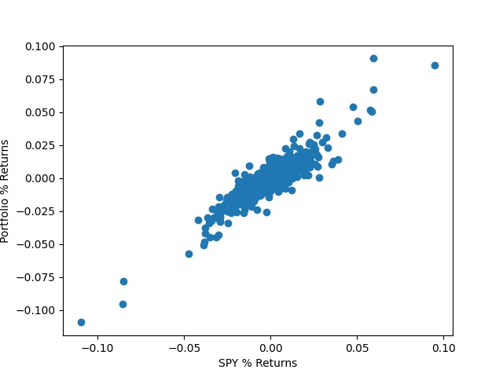

<style>
r { color: Blue }
o { color: Orange }
g { color: Green }
</style>
**Candidate Number**:243655

\newcommand{\sig}{\tilde{\sigma_1}}
\newcommand{\sigg}{\tilde{\sigma_2}}
# Q1
## a


We see that there seems to be a linear relationship between returns of S&P500 and the returns of the portfolio.Also, the alpha of this portfolio seems to be zero as the intercept seems to be 0.
The code written to do the calculations can be found in appendix.

## b

\begin{table}[H]
\centering
\caption{Mean of all Stock Returns }
\resizebox{\textwidth}{!}{\begin{tabular}{lrrrrrrr}
\toprule
{} &  ln\_ret\_DBE\_mean &  ln\_ret\_JPM\_mean &  ln\_ret\_MA\_mean &  ln\_ret\_NFLX\_mean &  ln\_ret\_SPY\_mean &  ln\_ret\_WMT\_mean &  portfolio\_log\_returns\_mean \\
\midrule
0 &         0.000209 &         0.000648 &        0.001037 &          0.001297 &         0.000622 &         0.000681 &                    0.000774 \\
\bottomrule
\end{tabular}}
\end{table}

\begin{table}[H]
\caption{Covariance Matrix}
\resizebox{\textwidth}{!}{\begin{tabular}{lrrrrrrr}
\toprule
{} &  ln\_ret\_DBE &  ln\_ret\_JPM &  ln\_ret\_MA &  ln\_ret\_NFLX &  ln\_ret\_SPY &  ln\_ret\_WMT &  portfolio\_log\_returns \\
\midrule
ln\_ret\_DBE            &    0.000294 &    0.000128 &   0.000115 &     0.000069 &    0.000090 &    0.000030 &               0.000127 \\
ln\_ret\_JPM            &    0.000128 &    0.000369 &   0.000224 &     0.000098 &    0.000177 &    0.000073 &               0.000178 \\
ln\_ret\_MA             &    0.000115 &    0.000224 &   0.000360 &     0.000185 &    0.000187 &    0.000083 &               0.000193 \\
ln\_ret\_NFLX           &    0.000069 &    0.000098 &   0.000185 &     0.000588 &    0.000145 &    0.000089 &               0.000206 \\
ln\_ret\_SPY            &    0.000090 &    0.000177 &   0.000187 &     0.000145 &    0.000146 &    0.000080 &               0.000136 \\
ln\_ret\_WMT            &    0.000030 &    0.000073 &   0.000083 &     0.000089 &    0.000080 &    0.000191 &               0.000093 \\
portfolio\_log\_returns &    0.000127 &    0.000178 &   0.000193 &     0.000206 &    0.000136 &    0.000093 &               0.000160 \\
\bottomrule
\end{tabular}}
\end{table}


\begin{table}[H]
\centering
\caption{Beta Calculated from Covariance Matrix}
\resizebox{\textwidth}{!}{\begin{tabular}{lrrrrrrr}
\toprule
{} &  DBE\_beta &  JPM\_beta &   MA\_beta &  NFLX\_beta &  SPY\_beta &  WMT\_beta &  portfolio\_returns\_beta \\
\midrule
0 &  0.614786 &  1.213279 &  1.278208 &   0.990475 &       1.0 &  0.547793 &                0.928908 \\
\bottomrule
\end{tabular}}
\end{table}

$\beta_{s} = \frac{\Cov[R_m,R_s]}{\Var[R_m]}$

where $\beta_s$ is Beta of the stock,
$\Cov[R_m,R_s]$ is the covariance of the stock and market index,
$\Var[R_m]$ is the variance of the  market index.

## c


\begin{table}[H]
\centering
\caption{Portfolio Return Info}
\begin{tabular}{lrr}
\toprule
{} &  portfolio\_annual\_mean\_returns &  portfolio\_std\_returns \\
\midrule
0 &                       0.193622 &                0.19971 \\
\bottomrule
\end{tabular}
\end{table}

$\mu_{1y} = \mu_{1d}*250$

$\sigma_{1y} = \sigma_{1d}*\sqrt{250}$

where, 

$\mu_{1y}$ and $\mu_{1d}$ are annual and daily log-returns respectively and

$\sigma_{1y}$ and $\sigma_{1d}$ are annual and daily standard deviation of log-returns respectively 

## d
Given below are the regression results for the stocks and Portfolio,

\begin{table}[H]
\caption{DBE Beta obtained from OLS}
\label{}
\begin{center}
\begin{tabular}{llll}
\hline
Model:              & OLS              & Adj. R-squared:     & 0.180       \\
Dependent Variable: & \%ret\_DBE       & AIC:                & -6571.1406  \\
Date:               & 2021-12-06 17:57 & BIC:                & -6560.9722  \\
No. Observations:   & 1193             & Log-Likelihood:     & 3287.6      \\
Df Model:           & 1                & F-statistic:        & 262.7       \\
Df Residuals:       & 1191             & Prob (F-statistic): & 1.54e-53    \\
R-squared:          & 0.181            & Scale:              & 0.00023696  \\
\hline
\end{tabular}
\end{center}

\begin{center}
\begin{tabular}{lrrrrrr}
\hline
           &   Coef. & Std.Err. &       t & P$> |$t$|$ &  [0.025 & 0.975]  \\
\hline
const      & -0.0001 &   0.0004 & -0.1760 &      0.8603 & -0.0010 & 0.0008  \\
\%ret\_SPY &  0.6008 &   0.0371 & 16.2076 &      0.0000 &  0.5281 & 0.6735  \\
\hline
\end{tabular}
\end{center}

\begin{center}
\begin{tabular}{llll}
\hline
Omnibus:       & 144.633 & Durbin-Watson:    & 2.080    \\
Prob(Omnibus): & 0.000   & Jarque-Bera (JB): & 873.041  \\
Skew:          & -0.371  & Prob(JB):         & 0.000    \\
Kurtosis:      & 7.125   & Condition No.:    & 83       \\
\hline
\end{tabular}
\end{center}
\end{table}

\begin{table}[H]
\caption{JPM Beta obtained from OLS}
\label{}
\begin{center}
\begin{tabular}{llll}
\hline
Model:              & OLS              & Adj. R-squared:     & 0.577       \\
Dependent Variable: & \%ret\_JPM       & AIC:                & -7066.2687  \\
Date:               & 2021-12-06 17:57 & BIC:                & -7056.1002  \\
No. Observations:   & 1193             & Log-Likelihood:     & 3535.1      \\
Df Model:           & 1                & F-statistic:        & 1627.       \\
Df Residuals:       & 1191             & Prob (F-statistic): & 5.92e-225   \\
R-squared:          & 0.577            & Scale:              & 0.00015647  \\
\hline
\end{tabular}
\end{center}

\begin{center}
\begin{tabular}{lrrrrrr}
\hline
           &   Coef. & Std.Err. &       t & P$> |$t$|$ &  [0.025 & 0.975]  \\
\hline
const      & -0.0000 &   0.0004 & -0.0076 &      0.9939 & -0.0007 & 0.0007  \\
\%ret\_SPY &  1.2149 &   0.0301 & 40.3329 &      0.0000 &  1.1558 & 1.2740  \\
\hline
\end{tabular}
\end{center}

\begin{center}
\begin{tabular}{llll}
\hline
Omnibus:       & 403.430 & Durbin-Watson:    & 1.989     \\
Prob(Omnibus): & 0.000   & Jarque-Bera (JB): & 6244.410  \\
Skew:          & 1.131   & Prob(JB):         & 0.000     \\
Kurtosis:      & 13.978  & Condition No.:    & 83        \\
\hline
\end{tabular}
\end{center}
\end{table}

\begin{table}[H]
\caption{NFLX Beta obtained from OLS}
\label{}
\begin{center}
\begin{tabular}{llll}
\hline
Model:              & OLS              & Adj. R-squared:     & 0.238       \\
Dependent Variable: & \%ret\_NFLX      & AIC:                & -5803.1402  \\
Date:               & 2021-12-06 17:57 & BIC:                & -5792.9717  \\
No. Observations:   & 1193             & Log-Likelihood:     & 2903.6      \\
Df Model:           & 1                & F-statistic:        & 373.7       \\
Df Residuals:       & 1191             & Prob (F-statistic): & 1.27e-72    \\
R-squared:          & 0.239            & Scale:              & 0.00045107  \\
\hline
\end{tabular}
\end{center}

\begin{center}
\begin{tabular}{lrrrrrr}
\hline
           &  Coef. & Std.Err. &       t & P$> |$t$|$ &  [0.025 & 0.975]  \\
\hline
const      & 0.0009 &   0.0006 &  1.4691 &      0.1421 & -0.0003 & 0.0021  \\
\%ret\_SPY & 0.9886 &   0.0511 & 19.3302 &      0.0000 &  0.8883 & 1.0890  \\
\hline
\end{tabular}
\end{center}

\begin{center}
\begin{tabular}{llll}
\hline
Omnibus:       & 222.599 & Durbin-Watson:    & 2.011     \\
Prob(Omnibus): & 0.000   & Jarque-Bera (JB): & 2179.164  \\
Skew:          & 0.554   & Prob(JB):         & 0.000     \\
Kurtosis:      & 9.528   & Condition No.:    & 83        \\
\hline
\end{tabular}
\end{center}
\end{table}

\begin{table}[H]
\caption{WMT Beta obtained from OLS}
\label{}
\begin{center}
\begin{tabular}{llll}
\hline
Model:              & OLS              & Adj. R-squared:     & 0.228       \\
Dependent Variable: & \%ret\_WMT       & AIC:                & -7124.7892  \\
Date:               & 2021-12-06 17:57 & BIC:                & -7114.6208  \\
No. Observations:   & 1193             & Log-Likelihood:     & 3564.4      \\
Df Model:           & 1                & F-statistic:        & 353.3       \\
Df Residuals:       & 1191             & Prob (F-statistic): & 3.21e-69    \\
R-squared:          & 0.229            & Scale:              & 0.00014898  \\
\hline
\end{tabular}
\end{center}

\begin{center}
\begin{tabular}{lrrrrrr}
\hline
           &  Coef. & Std.Err. &       t & P$> |$t$|$ &  [0.025 & 0.975]  \\
\hline
const      & 0.0004 &   0.0004 &  1.0611 &      0.2889 & -0.0003 & 0.0011  \\
\%ret\_SPY & 0.5524 &   0.0294 & 18.7950 &      0.0000 &  0.4948 & 0.6101  \\
\hline
\end{tabular}
\end{center}

\begin{center}
\begin{tabular}{llll}
\hline
Omnibus:       & 416.290 & Durbin-Watson:    & 2.041      \\
Prob(Omnibus): & 0.000   & Jarque-Bera (JB): & 12388.448  \\
Skew:          & 0.983   & Prob(JB):         & 0.000      \\
Kurtosis:      & 18.664  & Condition No.:    & 83         \\
\hline
\end{tabular}
\end{center}
\end{table}

\begin{table}[H]
\caption{MA Beta obtained from OLS}
\label{}
\begin{center}
\begin{tabular}{llll}
\hline
Model:              & OLS              & Adj. R-squared:     & 0.662       \\
Dependent Variable: & \%ret\_MA        & AIC:                & -7360.6919  \\
Date:               & 2021-12-06 18:13 & BIC:                & -7350.5235  \\
No. Observations:   & 1193             & Log-Likelihood:     & 3682.3      \\
Df Model:           & 1                & F-statistic:        & 2333.       \\
Df Residuals:       & 1191             & Prob (F-statistic): & 8.19e-283   \\
R-squared:          & 0.662            & Scale:              & 0.00012225  \\
\hline
\end{tabular}
\end{center}

\begin{center}
\begin{tabular}{lrrrrrr}
\hline
           &  Coef. & Std.Err. &       t & P$> |$t$|$ &  [0.025 & 0.975]  \\
\hline
const      & 0.0003 &   0.0003 &  1.0446 &      0.2964 & -0.0003 & 0.0010  \\
\%ret\_SPY & 1.2860 &   0.0266 & 48.2991 &      0.0000 &  1.2337 & 1.3382  \\
\hline
\end{tabular}
\end{center}

\begin{center}
\begin{tabular}{llll}
\hline
Omnibus:       & 163.997 & Durbin-Watson:    & 2.062     \\
Prob(Omnibus): & 0.000   & Jarque-Bera (JB): & 1935.573  \\
Skew:          & 0.066   & Prob(JB):         & 0.000     \\
Kurtosis:      & 9.239   & Condition No.:    & 83        \\
\hline
\end{tabular}
\end{center}
\end{table}

\begin{table}[H]
\caption{portfolio\_returns\_percentage Beta obtained from OLS}
\label{}
\begin{center}
\begin{tabular}{llll}
\hline
Model:              & OLS                            & Adj. R-squared:     & 0.787       \\
Dependent Variable: & portfolio\_returns\_percentage & AIC:                & -8895.2341  \\
Date:               & 2021-12-06 17:57               & BIC:                & -8885.0657  \\
No. Observations:   & 1193                           & Log-Likelihood:     & 4449.6      \\
Df Model:           & 1                              & F-statistic:        & 4402.       \\
Df Residuals:       & 1191                           & Prob (F-statistic): & 0.00        \\
R-squared:          & 0.787                          & Scale:              & 3.3777e-05  \\
\hline
\end{tabular}
\end{center}

\begin{center}
\begin{tabular}{lrrrrrr}
\hline
           &  Coef. & Std.Err. &       t & P$> |$t$|$ &  [0.025 & 0.975]  \\
\hline
const      & 0.0003 &   0.0002 &  1.8203 &      0.0690 & -0.0000 & 0.0006  \\
\%ret\_SPY & 0.9285 &   0.0140 & 66.3474 &      0.0000 &  0.9011 & 0.9560  \\
\hline
\end{tabular}
\end{center}

\begin{center}
\begin{tabular}{llll}
\hline
Omnibus:       & 69.193 & Durbin-Watson:    & 2.028    \\
Prob(Omnibus): & 0.000  & Jarque-Bera (JB): & 247.699  \\
Skew:          & 0.134  & Prob(JB):         & 0.000    \\
Kurtosis:      & 5.216  & Condition No.:    & 83       \\
\hline
\end{tabular}
\end{center}
\end{table}

From the above tables we have,
$\beta_{portfolio} = 0.9285,\beta_{MA} = 1.286,\beta_{WMT}=0.5524,\beta_{NFLX} = 0.9886,\beta_{JPM} = 1.2149,
\beta_{DBE} = 0.6008$

This is roughly equivalent to the beta obtained using the covariance matrix.

We see from the standard error and p-value results above that the $\alpha$ is 0 for each of the stocks and the portfolio.

## e
Idiosyncratic Risk is the risk associated with the individual stock or investment which cannot be modelled by 
CAPM. For eg the risk of a company going bankrupt.


From the above regression, we get R-squared as 0.787 and hence the unsystemic risk of the portfolio is $1-0.787 = 0.213$.

$\textrm{Residual}_{t} = (R_t - (\beta*R_{mt} + \alpha))^{2}$

where, in this case $R_{t}$ is portfolio return at time $t$ and $R_{mt}$ is the market index return at time $t$. 
\begin{figure}[h]
\caption{Idiosyncratic Risk of Portfolio over time}
\includegraphics{residualplot.jpg}
\end{figure}

# Appendix(Python Code)

## All the neccesary imports

```python
   import pandas as pd
   import os
   import statsmodels.api as sm
   import yfinance as yf
   import numpy as np
   import matplotlib.pyplot as plt
```
## Downloading Data 

```python
   # Downloading Data of certain stocks and S&P500 from Yahoo Finance
   k = yf.download('SPY DBE JPM MA NFLX WMT',start='2016-12-31',end='2021-09-30')
   # Remove all columns except adjusted Close
   k=k[[i for i in k.columns if 'Adj Close' in i]] 
   k=k.set_axis(k.columns.map('_'.join), axis=1, inplace=False)
```
## Calculating Returns and Saving Figure
```python
for i in k.columns:
    logcolname = f"ln_ret_{i[10:]}"
    ord_ret = f"%ret_{i[10:]}" # Column name for percentage returns
    k[logcolname] = np.log(k[i]/k[i].shift(1)) # Calculating log returns 
    k[ord_ret] = np.exp(k[logcolname])-1 # calculating percentage returns from log returns
print(k)
# Extracting Columns Names of only stocks
per_ret=[i for i in k.columns if "%ret" in i and 'SPY' not in i] 
log_ret=[i for i in k.columns if "ln_ret" in i and 'SPY' not in i]
k['portfolio_returns_percentage'] = k[per_ret].mean(axis=1) #Calculating Portfolio Returns
k['portfolio_log_returns'] = k[log_ret].mean(axis=1 # Calculating log portfolio returns
plt.scatter(k.portfolio_returns_percentage,k['%ret_SPY']) #Plotting Scatter Plot
plt.xlabel("SPY % Returns")
plt.ylabel("Portfolio % Returns")
plt.savefig("ScatterPlot.jpg")

```
## Calculating Means

```python
return_info1 = pd.DataFrame() # For calculating Mean of all series
for i in cov_mat_cols:
    return_info1[f"{i}_mean"] = [k[i].mean()]
```

## Calculating Covariance and Beta

```python
# Extracting Columns for covariance matrix
cov_mat_cols =[i for i in k.columns if 'ln_ret' in i or 'log_returns' in i]
cov_mat = k[cov_mat_cols].cov() # covariance matrix of markets and portfolio
info = pd.DataFrame()
for i in cov_mat.columns[:-1]:
    
    info[f"{i[7:]}_beta"]=[cov_mat.loc['ln_ret_SPY',i]/cov_mat.loc[
    'ln_ret_SPY','ln_ret_SPY']]
# Computing beta for portfolio returns
info[f"portfolio_returns_beta"]=[
        cov_mat.loc[
        'ln_ret_SPY','portfolio_log_returns']/cov_mat.loc['ln_ret_SPY','ln_ret_SPY']] 
print(info)
```

## Calculating Annualized Mean and Standard Deviation

```python

return_info = pd.dataFrame()
return_info['portfolio_annual_mean_returns'] = [k.portfolio_log_returns.mean()*250]
return_info['portfolio_std_returns'] = [k.portfolio_log_returns.std()*250**.5]
```

## Calculating Beta using OLS

```python
per_ret=[i for i in k.columns if "%ret" in i and 'SPY' not in i]
per_ret1 = per_ret + ['portfolio_returns_percentage']
latexdict = dict()

for i in per_ret1:
    y = k[i].dropna()
    x = k['%ret_SPY'].dropna()
    x = x-0.01/250 # Subtract risk free rate
    x = sm.add_constant(x) # Add constant for intercept
    model = sm.OLS(y-0.01/250,x)
    res = model.fit()
    print(res.summary())
    if i!='portfolio_returns_percentage':
     # Converting to Latex table  
     lat = res.summary2(title=f"{i[5:]} Beta obtained from OLS").as_latex() 
    else:
     lat = res.summary2(title=f"{i} Beta obtained from OLS").as_latex()
    latexdict[i] = lat
lkey = list(latexdict.keys())
```
## Calculating and Plotting Idiosyncratic Risk
```python
k['residual'] = (k.portfolio_returns_percentage - 0.9285*k['%ret_SPY'])**2  
# Only beta is considered above as alpha is 0
plt.clf()
plt.plot(k.residual)
plt.xlabel("Time")
plt.ylabel("CAPM Residual")
plt.savefig("residualplot.jpg")

plt.show()
```

